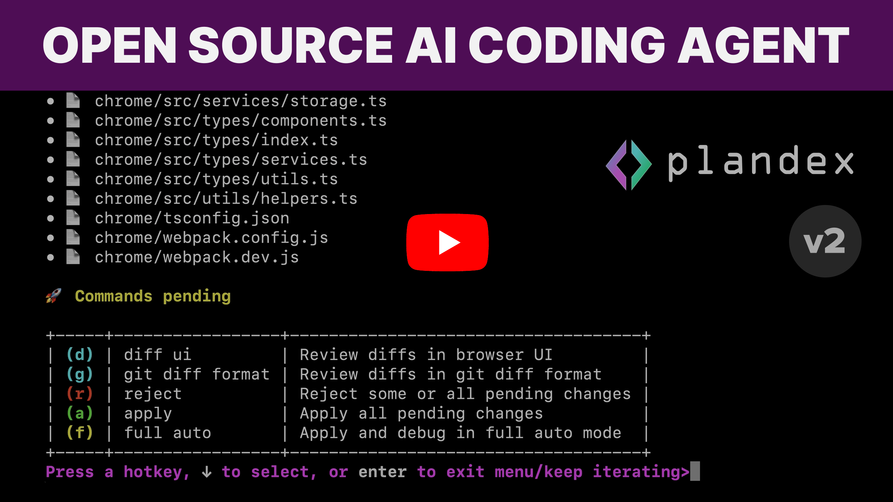
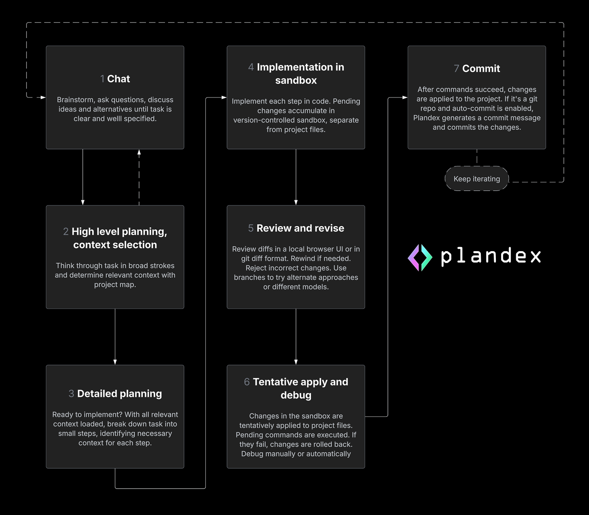
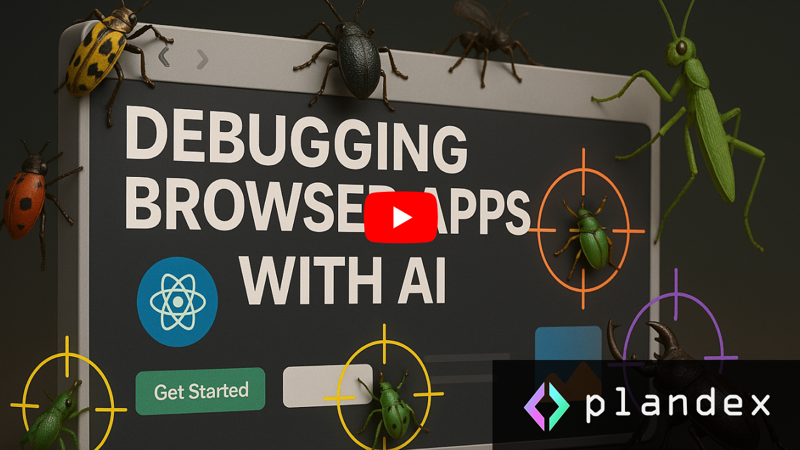

<h1 align="center">
 <a href="https://plandex.ai">
  <picture>
    <source media="(prefers-color-scheme: dark)" srcset="images/plandex-logo-dark-v2.png"/>
    <source media="(prefers-color-scheme: light)" srcset="images/plandex-logo-light-v2.png"/>
    
 </a>
 <br />
</h1>
<br />

<div align="center">

<p align="center">
  <!-- Call to Action Links -->
  <a href="#install">
    <b>30-Second Install</b>
  </a>
   · 
  <a href="https://plandex.ai">
    <b>Website</b>
  </a>
   · 
  <a href="https://docs.plandex.ai/">
    <b>Docs</b>
  </a>
   · 
  <a href="#examples-">
    <b>Examples</b>
  </a>
   · 
  <a href="https://docs.plandex.ai/hosting/self-hosting/local-mode-quickstart">
    <b>Local Self-Hosted Mode</b>
  </a>
</p>

<br>

[](https://discord.gg/plandex-ai)
[](https://github.com/plandex-ai/plandex)
[](https://twitter.com/PlandexAI)

</div>

<p align="center">
  <!-- Badges -->
<a href="https://github.com/plandex-ai/plandex/pulls"></a> <a href="https://github.com/plandex-ai/plandex/releases?q=cli"></a>
<a href="https://github.com/plandex-ai/plandex/releases?q=server"></a>

  <!-- <a href="https://github.com/your_username/your_project/issues">
    
  </a> -->

</p>

<br />

<div align="center">
<a href="https://trendshift.io/repositories/8994" target="_blank"></a>
</div>

<br>

<h1 align="center" >
  An AI coding agent designed for large tasks and real world projects.<br/><br/>
</h1>

<!-- <h2 align="center">
  Designed for large tasks and real world projects.<br/><br/>
  </h2> -->
  <br/>

<div align="center">
  <a href="https://www.youtube.com/watch?v=SFSu2vNmlLk">
    
  </a>
</div>

<br/>

💻  Plandex is a terminal-based AI development tool that can **plan and execute** large coding tasks that span many steps and touch dozens of files. It can handle up to 2M tokens of context directly (~100k per file), and can index directories with 20M tokens or more using tree-sitter project maps. 

🔬  **A cumulative diff review sandbox** keeps AI-generated changes separate from your project files until they are ready to go. Command execution is controlled so you can easily roll back and debug. Plandex helps you get the most out of AI without leaving behind a mess in your project.

🧠  **Combine the best models** from Anthropic, OpenAI, Google, and open source providers to build entire features and apps with a robust terminal-based workflow.

🚀  Plandex is capable of <strong>full autonomy</strong>—it can load relevant files, plan and implement changes, execute commands, and automatically debug—but it's also highly flexible and configurable, giving developers fine-grained control and a step-by-step review process when needed.

💪  Plandex is designed to be resilient to <strong>large projects and files</strong>. If you've found that others tools struggle once your project gets past a certain size or the changes are too complex, give Plandex a shot.

## Smart context management that works in big projects

- 🐘 **2M token effective context window** with default model pack. Plandex loads only what's needed for each step.

- 🗄️ **Reliable in large projects and files.** Easily generate, review, revise, and apply changes spanning dozens of files.

- 🗺️ **Fast project map generation** and syntax validation with tree-sitter. Supports 30+ languages.

- 💰 **Context caching** is used across the board for OpenAI, Anthropic, and Google models, reducing costs and latency.

## Tight control or full autonomy—it's up to you

- 🚦 **Configurable autonomy:** go from full auto mode to fine-grained control depending on the task.

- 🐞 **Automated debugging** of terminal commands (like builds, linters, tests, deployments, and scripts). If you have Chrome installed, you can also automatically debug browser applications.

## Tools that help you get production-ready results

- 💬 **A project-aware chat mode** that helps you flesh out ideas before moving to implementation. Also great for asking questions and learning about a codebase.

- 🧠 **Easily try + combine models** from multiple providers. Curated model packs offer different tradeoffs of capability, cost, and speed, as well as open source and provider-specific packs.

- 🛡️ **Reliable file edits** that prioritize correctness. While most edits are quick and cheap, Plandex validates both syntax and logic as needed, with multiple fallback layers when there are problems.

- 🔀 **Full-fledged version control** for every update to the plan, including branches for exploring multiple paths or comparing different models.

- 📂 **Git integration** with commit message generation and optional automatic commits.

## Dev-friendly, easy to install

- 🧑‍💻 **REPL mode** with fuzzy auto-complete for commands and file loading. Just run `plandex` in any project to get started.

- 🛠️ **CLI interface** for scripting or piping data into context.

- 📦 **One-line, zero dependency CLI install**. Dockerized local mode for easily self-hosting the server. Cloud-hosting options for extra reliability and convenience.


## Workflow  🔄



## Examples  🎥

  <br/>

<div align="center">
  <a href="https://www.youtube.com/watch?v=g-_76U_nK0Y">
    
  </a>
</div>

<br/>

## Install  📥

```bash
curl -sL https://plandex.ai/install.sh | bash
```

**Note:** Windows is supported via [WSL](https://learn.microsoft.com/en-us/windows/wsl/install). Plandex only works correctly on Windows in the WSL shell. It doesn't work in the Windows CMD prompt or PowerShell.

[More installation options.](https://docs.plandex.ai/install)

## Hosting  ⚖️

| Option                                | Description                                                                                                                                                                                                                                                 |
| ------------------------------------- | ----------------------------------------------------------------------------------------------------------------------------------------------------------------------------------------------------------------------------------------------------------- |
| **Plandex Cloud (Integrated Models)** | • No separate accounts or API keys.<br/>• Easy multi-device usage.<br/>• Centralized billing, budgeting, usage tracking, and cost reporting.<br/>• Quickest way to [get started.](https://app.plandex.ai/start?modelsMode=integrated)                                                        |
| **Plandex Cloud (BYO API Key)**       | • Use Plandex Cloud with your own [OpenRouter.ai](https://openrouter.ai) key (and **optionally** your own [OpenAI](https://platform.openai.com) key).<br/>• [Get started](https://app.plandex.ai/start?modelsMode=byo)                                                                   |
| **Self-hosted/Local Mode**            | • Run Plandex locally with Docker or host on your own server.<br/>• Use your own [OpenRouter.ai](https://openrouter.ai) key (and **optionally** your own [OpenAI](https://platform.openai.com) key).<br/>• Follow the [local-mode quickstart](https://docs.plandex.ai/hosting/self-hosting/local-mode-quickstart) to get started. |

## Provider keys  🔑

If you're going with a 'BYO API Key' option above (whether cloud or self-hosted), you'll need to set the `OPENROUTER_API_KEY` environment variable before continuing:

```bash
export OPENROUTER_API_KEY=...
```

You can also **optionally** set a `OPENAI_API_KEY` environment variable if you want OpenAI models to use the OpenAI API directly instead of OpenRouter (for slightly lower latency and costs):

```bash
export OPENAI_API_KEY=...
```

<br/>

## Get started  🚀

First, `cd` into a **project directory** where you want to get something done or chat about the project. Make a new directory first with `mkdir your-project-dir` if you're starting on a new project.

```bash
cd your-project-dir
```

For a new project, you might also want to initialize a git repo. Plandex doesn't require that your project is in a git repo, but it does integrate well with git if you use it.

```bash
git init
```

Now start the Plandex REPL in your project:

```bash
plandex
```

or for short:

```bash
pdx
```

☁️ _If you're using Plandex Cloud, you'll be prompted at this point to start a trial._

Then just give the REPL help text a quick read, and you're ready go. The REPL starts in _chat mode_ by default, which is good for fleshing out ideas before moving to implementation. Once the task is clear, Plandex will prompt you to switch to _tell mode_ to make a detailed plan and start writing code.

<br/>

## Docs  🛠️

### [👉  Full documentation.](https://docs.plandex.ai/)

<br/>

## Discussion and discord  💬

Please feel free to give your feedback, ask questions, report a bug, or just hang out:

- [Discord](https://discord.gg/plandex-ai)
- [Discussions](https://github.com/plandex-ai/plandex/discussions)
- [Issues](https://github.com/plandex-ai/plandex/issues)

## Follow and subscribe

- [Follow @PlandexAI](https://x.com/PlandexAI)
- [Follow @Danenania](https://x.com/Danenania) (Plandex's creator)
- [Subscribe on YouTube](https://x.com/PlandexAI)

<br/>

## Contributors  👥

⭐️  Please star, fork, explore, and contribute to Plandex. There's a lot of work to do and so much that can be improved.

[Here's an overview on setting up a development environment.](https://docs.plandex.ai/development)
