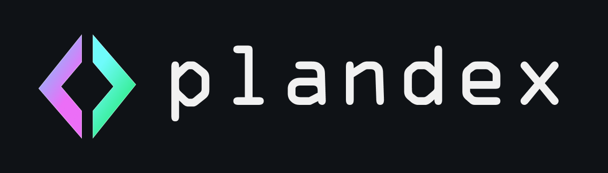
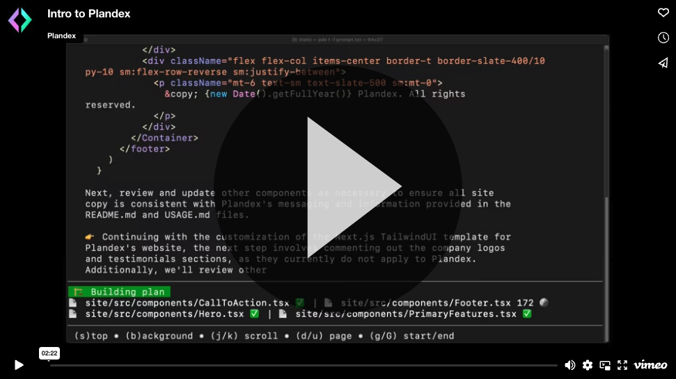

<h1 align="center">
 <a href="https://plandex.ai">
  <picture>
    <source media="(prefers-color-scheme: dark)" srcset="images/plandex-logo-dark.png"/>
    <source media="(prefers-color-scheme: light)" srcset="images/plandex-logo-light.png"/>
    
 </a>
 <br />
</h1>
<br />

<p align="center"><strong>🔮 An open source, terminal-based AI coding engine for complex tasks.</strong></p>

<p align="center">
  <!-- Badges -->
<a href="https://github.com/plandex-ai/plandex/pulls"></a> 
<a href="https://github.com/plandex-ai/plandex/releases?q=cli"></a>
<a href="https://github.com/plandex-ai/plandex/releases?q=server"></a>

  <!-- <a href="https://github.com/your_username/your_project/issues">
    
  </a> -->

</p>

<p align="center">
  <!-- Call to Action Links -->
  <a href="#install">
    <b>Install</b>
  </a>
  ·
  <!-- <a href="https://plandex.ai">
    <b>Website</b>
  </a>
  · -->
  <a href="./guides/USAGE.md">
    <b>Usage</b>
  </a>
  ·
  <a href="./guides/HOSTING.md">
    <b>Self-Hosting</b>
  </a>
  ·
  <a href="./guides/DEVELOPMENT.md">
    <b>Development</b>
  </a>
  ·
  <a href="https://discord.gg/plandex-ai">
    <b>Discord</b>
  </a>  
</p>

<br/>

<p>Plandex uses long-running agents to complete tasks that require many steps. It breaks up large tasks into smaller subtasks, then implements each one, continuing until it finishes the job. It helps you churn through your backlog, work with unfamiliar technologies, get unstuck, and spend less time on the boring stuff. </p>

<br/>

<!-- Vimeo link is nicer on mobile than embedded video... downside is it navigates to vimeo in same tab (no way to add target=_blank) -->
<!-- https://github.com/plandex-ai/plandex/assets/545350/c2ee3bcd-1512-493f-bdd5-e3a4ca534a36 -->

<a href="https://player.vimeo.com/video/926634577">
  
</a>

<br/>
<br/>

## 🌟  Build complex software with LLMs

⚡️  Changes are accumulated in a protected sandbox so that you can review them before automatically applying them to your project files. Built-in version control allows you to easily go backwards and try a different approach. Branches allow you to try multiple approaches and compare the results.

📑  Manage context efficiently in the terminal. Easily add files or entire directories to context, and keep them updated automatically as you work so that models are always working with the latest state of your project.

🧠  Plandex relies on the OpenAI API and requires an `OPENAI_API_KEY` environment variable. Support for open source models, Google Gemini, and Anthropic Claude is coming soon.

✅  Plandex supports Mac, Linux, FreeBSD, and Windows. It runs from a single binary with no dependencies.

## Install  📥

### Quick install

```bash
curl -sL https://plandex.ai/install.sh | bash
```

<details>
 <summary><b>Manual install</b></summary>
 <br>
<p>
Grab the appropriate binary for your platform from the latest <a href="https://github.com/plandex-ai/plandex/releases">release</a> and put it somewhere in your <code>PATH</code>.
</p>
</details>

<details>
<summary><b>Build from source</b></summary>

<p>
<pre><code>git clone https://github.com/plandex-ai/plandex.git
cd plandex/app/cli
go build -ldflags "-X plandex/version.Version=$(cat version.txt)"
mv plandex /usr/local/bin # adapt as needed for your system
</code></pre>
</p>
</details>

<details>
<summary><b>Windows</b></summary>
<br>
<p>
Windows is supported via <a href="https://gitforwindows.org">Git bash</a> or <a href="https://learn.microsoft.com/en-us/windows/wsl/about">WSL</a>.
</p>
</details>

## Get started  🚀

If you don't have an OpenAI account, first [sign up here.](https://platform.openai.com/signup)

Then [generate an API key here.](https://platform.openai.com/account/api-keys)

```bash
cd your-project
export OPENAI_API_KEY=...
plandex new
```

After any plandex command is run, commands that could make sense to run next will be suggested. You can learn to use Plandex quickly by jumping in and following these suggestions.

## Usage  🛠️

[Here's a quick overview of the commands and functionality.](./guides/USAGE.md)

## Help  ℹ️

To see all available commands:

```
plandex help
```

For help on any command:

```
plandex [command] --help
```

## Why Plandex?  🤔

🏗️  Go beyond autocomplete to build complex functionality with AI.<br>
🚫  Stop the mouse-centered, copy-pasting madness of coding with ChatGPT.<br>
📑  Manage context efficiently in the terminal.<br>
⚡️  Ensure AI models always have the latest versions of files in context.<br>
🪙  Retain granular control over what's in context and how many tokens you're using.<br>
🚧  Experiment, revise, and review in a protected sandbox before applying changes.<br>
⏪  Rewind and retry as needed.<br>
🌱  Explore multiple approaches with branches.<br>
🔀  Run tasks in the background or work on multiple tasks in parallel.<br>
🎛️  Try different models and model settings, then compare results.<br>

## Plandex Cloud  ☁️

Plandex Cloud is the easiest and most reliable way to use Plandex. You'll be prompted to start an anonymous trial (no email required) when you create your first plan with `plandex new`. Trial accounts are limited to 10 plans and 10 AI model replies per plan. You can upgrade to an unlimited account with your name and email.

Plandex Cloud accounts are free for now. In the future, they will cost somewhere in the $10-20 per month range.

## Self-hosting  🏠

[Read about self-hosting Plandex here.](./guides/HOSTING.md)

## Limitations and guidance ⚠️

- Plandex can provide a significant boost to your productivity, but as with any other AI tool, you shouldn't expect perfect results. Always review a plan carefully before applying changes, especially if security is involved. Plandex is designed to get you 80-90% of the way there rather than 100%.

- Due to the reasoning limitations of LLMs, automatically applied file updates also aren't perfect. While these can be improved over time with better prompting strategies (contributions welcome) and better models, be prepared for occasional updates that aren't quite right. Use the `plandex changes` command to review pending updates in a TUI. If a file update has mistakes, make those changes yourself with copy-and-paste and reject the file in the changes TUI.

- The more direction and detail you provide, the better the results will be. Working with Plandex often involves giving it a prompt, seeing that the results are a bit off, then using `plandex rewind` to go back and iterate on the prompt or add context before trying again. Branches are also useful for trying different approaches.

- While it can be tempting to just dump your entire project into context if it fits under the token limit, with current models you will tend to see better results (and pay less) by being more selective about what's loaded into context.

## Security  🔐

Plandex Cloud follows best practices for network and data security. And whether cloud or self-hosted, Plandex protects model provider API keys (like your OpenAI API key). [Read more here.](./guides/SECURITY.md)

## Privacy and data retention  🛡️

[Read about Plandex Cloud's privacy and data retention policies here.](./guides/PRIVACY.md)

## Roadmap  🗺️

🧠  Support for open source models, Google Gemini, and Anthropic Claude in addition to OpenAI<br>
🤝  Plan sharing and team collaboration<br>
🖼️  Support for GPT4-Vision and other multi-modal models—add images and screenshots to context<br>
🖥️  VSCode and JetBrains extensions<br>
📦  Community plugins and modules<br>
🔌  Github integration<br>
🌐  Web dashboard and GUI<br>
🔐  SOC2 compliance<br>
🛩️  Fine-tuned models<br>

This list will grow and be prioritized based on your feedback.

## Discussion and discord  💬

Speaking of feedback, feel free to give yours, ask questions, report a bug, or just hang out:

- [Discord](https://discord.gg/plandex-ai)
- [Discussions](https://github.com/plandex-ai/plandex/discussions)
- [Issues](https://github.com/plandex-ai/plandex/issues)

## Contributors  👥

⭐️  Please star, fork, explore, and contribute to Plandex. There's a lot of work to do and so much that can be improved.

Work on tests, evals, prompts, and bug fixes is especially appreciated.

[Here's an overview on setting up a development environment.](./guides/DEVELOPMENT.md)

## Comparable tools ⚖️

- [Aider](https://github.com/paul-gauthier/aider)
- [Mentat](https://github.com/AbanteAI/mentat)
- [Pythagora Gpt-pilot](https://github.com/Pythagora-io/gpt-pilot)
- [Sourcegraph Cody](https://github.com/sourcegraph/cody)
- [Continue.dev](https://github.com/continuedev/continue)
- [Sweep.dev](https://github.com/sweepai/sweep)
- [Cursor](https://github.com/getcursor/cursor)
- [Github Copilot](https://github.com/features/copilot)
- [Replit Ghostwriter](https://replit.com/ai)
- [Grimoire](https://chat.openai.com/g/g-n7Rs0IK86-grimoire)

## About the developer  👋

Hi, I'm Dane. I've been building and launching software products for 17 years. I went through YCombinator in winter 2018 with my devops security company, [EnvKey](https://envkey.com), which I continue to run today. I'm fascinated by LLMs and their potential to transform the practice of software development.

I live with my wife and 4 year old daughter on the SF peninsula in California. I grew up in the Finger Lakes region of upstate New York. I like reading fiction, listening to podcasts, fitness, and surfing.
